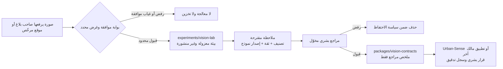

# من YOLO إلى «مدينة تُرى ولا تُراقَب»: خارطة بحث وتكامل مقيدة لـSENSE

**الحالة:** خارطة بحث وقرار معماري؛ لا يوجد في هذا المستند نموذج رؤية حاسوبية مشغّل، أو كاميرا متصلة، أو تكامل إنتاجي، أو بيانات مرئية حقيقية.  
**المصدران المرجعيان:** مستودع YOLO_Projects العام وأرشيف My-communication Academy العام.[1] [2]

## الفكرة الإبداعية

> ليست «المدينة الذكية» مدينة تلتقط أكبر قدر من الصور؛ بل مدينة تلتقط **الإشارة اللازمة فقط**، وتُبقي القرار والمسؤولية عند إنسان محدد، ثم تنسى ما لا تحتاجه.

تقدم قناة My-communication Academy لغة مفيدة عن طبقات التمكين—اتصال، أجهزة متصلة، أتمتة، بيانات، ومرونة—بينما يقدم مستودع YOLO أمثلة صغيرة على الرؤية الحاسوبية. لا ينبغي دمج المصدرين بوصفهما منتجًا جاهزًا، بل تحويلهما إلى مبدأ SENSE: **رصد محدود الغرض، بموافقة، وقرار بشري قابل للتدقيق**.

## 1. ما هو مستودع YOLO_Projects؟

المستودع العام [`Nawaf-Rayhan585/YOLO_Projects`][1] عبارة عن مجموعة أمثلة Python صغيرة مبنية على Ultralytics YOLO وOpenCV، تشمل: كشف المركبات، وعدّ الأشخاص، وخريطة كثافة للحشود، وكشف الأشخاص، والحريق، والقوارض، والسلوك المسمى «مشتبهًا به»، واكتشاف انشغال الهاتف. لا يمثل تطبيقًا متكاملًا أو خدمة تشغيلية موحدة.[1]

| الملاحظة التدقيقية | ما ظهر في المصدر | الأثر على قرار الاستخدام |
|---|---|---|
| الرخصة | لا يظهر ملف `LICENSE` في الجذر، وواجهة GitHub لا تعلن رخصة للمستودع. | لا ينسخ كوده أو يعاد توزيعه أو يدمج في منتج قبل إذن مكتوب من صاحبه أو رخصة صريحة. |
| التشغيل | README يذكر `requirements.txt` و`main.py`، لكن الملفين غير موجودين في النسخة المفحوصة. | ليس قابلاً للتشغيل بوصفه منتجًا موحدًا أو مرجع إعداد موثوقًا. |
| البنية | نصوص مستقلة بمسارات فيديو/نماذج ثابتة وواجهات OpenCV محلية. | لا توجد API أو هوية أو اختبار أو عزل بيانات أو إعداد نشر. |
| النماذج | يستدعي `yolov8n.pt` و`yolo11n.pt` و`yolo11s-pose.pt`. | استخدام Ultralytics يستلزم قرار ترخيص مستقل؛ لا تكفي رخصة مثال المصدر إن وُجدت.[3] |
| البيانات | بعض الأمثلة ترسم مربعات وهوية تتبع؛ مثال السلوك يحفظ صور أشخاص مقصوصة وبيانات مفاصل إلى مسار محلي. | هذا مسار عالي الحساسية وغير مناسب لـUrban‑Sense أو لأي تجربة عامة. |

توضح صفحة الترخيص الرسمية لـUltralytics أن استخدام كودها أو نماذجها أو أوزانها يتطلب إما الالتزام بـAGPL-3.0 للمشروع المشتق أو ترخيص Enterprise للحالات التي لا يراد فيها فتح المصدر بالكامل.[3] هذه ليست استشارة قانونية؛ وهي سبب كافٍ **لإيقاف أي دمج تقني** قبل مراجعة قانونية/ترخيصية مكتوبة.

## 2. ما الذي يصلح كإلهام، وما الذي لا يصلح؟

| مثال المصدر | قراءة SENSE المسؤولة | القرار المقترح |
|---|---|---|
| كشف المركبات | يمكن أن يلهم فحصًا تجريبيًا للصور التي يرفعها صاحب بلاغ عن عائق طريق أو حالة ميدانية. | لا تتبع مركبات، لا لوحات، لا بث كاميرات، ولا قرار بلدي آلي. |
| كشف الحريق | يمكن أن يلهم **تنبيهًا أوليًا** داخل موقع مرخّص ومغلق. | لا إنذار طوارئ أو إرسال بلاغ أو قرار سلامة من النموذج وحده؛ يلزم تأكيد بشري وبروتوكول جهة مختصة. |
| كشف القوارض | قد يلهم مسحًا منظمًا في منشأة توافق عليه الجهة المالكة. | لا تعميم لمخرجات النموذج كواقع بلدي قبل تحقق ميداني وتقييم دقة. |
| خريطة كثافة/عدّ | قد يفيد فعالية محدودة برضا المنظم وبأرقام مجمعة فقط. | لا معرفات تتبع، لا وجوه، لا لقطات محفوظة، ولا مراقبة أماكن عامة دائمة. |
| السلوك «المشتبه به» أو انشغال الهاتف | تصنيف سلوكي لأفراد وينتج في المصدر قصاصات وصورًا وبيانات مفاصل. | **مرفوض** من خارطة SENSE؛ لا يبنى ولا يعاد استخدامه. |

## 3. ربط دروس قناة التقنية بالمنظومة الحالية

فحص الأرشيف العام للقناة بلغ 7,222 منشورًا ظاهراً من المعرف 1 إلى 7,748. تضمّن 97 ذكرًا صريحًا للمدن الذكية، مع تقاطعات كبيرة مع IoT والبنية الاتصالية والأتمتة؛ لكنه ظل محتوى تمكينيًا وتعليميًا لا سجل تنفيذ مدينة ذكية أو شراكة مع SENSE.[2]

| درس من الأرشيف | ترجمته في SENSE | ما لا يعنيه |
|---|---|---|
| الشبكات والألياف و5G طبقات تمكين. | لا تجعل المنتج يعتمد على اتصال أو حساسات لم تثبت الحاجة إليها. | لا نقول إن Urban‑Sense يعمل على 5G أو يتكامل مع مزود اتصالات. |
| الأتمتة ولوحات التشغيل تحتاج مؤشرات واضحة. | يبقى سجل التدقيق وزمن المراجعة والإسناد والإغلاق أساس المنتج. | لا تتحول لوحة البلاغات إلى NOC أو مركز مراقبة. |
| IoT وEdge مفهومان مفيدان للمستقبل. | كل جهاز محتمل يمر بعقد بيانات محدود وإذن واحتفاظ قصير. | لا نجمع تدفقًا حيًا أو موقعًا دقيقًا أو صورًا لمجرد أن التقنية متاحة. |
| الأمن وإدارة الحوادث والحوكمة ضرورية. | توثيق الغرض، الصلاحية، الحدث، المراجعة، والحذف قبل التشغيل. | لا نستورد نصوص أو أمثلة القناة أو ندّعي شراكة معها. |

## 4. معمارية المستودع المقترحة

لا يدخل YOLO أو بث كاميرا إلى `apps/web`. ويبقى Urban‑Sense منصة بلاغات مدنية مستقلة، وتبقى SENSE Experience مستقلة بسياقها وقاعدة بياناتها. يُحتفظ بأي تجربة رؤية في مسار منفصل ومغلق، ولا تمرر إلا ملخصًا صغيرًا مراجعًا إلى التطبيق الذي يملك القضية.[4] [5]



| المسار المقترح | وظيفته | ما يمنع فيه صراحة |
|---|---|---|
| `docs/research/` | المصادر، سجل الرخص، تقييم المخاطر، وقرارات الاستخدام. | كود إنتاجي أو بيانات أو أوزان نماذج. |
| `docs/decision-records/ADR-vision-lab.md` | قرار تشغيل أو عدم تشغيل تجربة محددة، وصاحبها، وفترة التجربة. | قرار عام يفتح كل حالات الاستخدام. |
| `experiments/vision-lab/` | نموذج أولي منفصل، على مواد مصرح بها فقط، بعد قرار الترخيص. | نشر عام، مفاتيح، بث حي، اتصال بقاعدة Urban‑Sense. |
| `packages/vision-contracts/` | نوع ملخص مثل `reviewed_visual_observation_v1`. | صور خام، معرفات أشخاص، مسارات تتبع، أو حق في إغلاق بلاغ. |
| `apps/web` | يعرض الملخص المراجع كدليل ثانوي في البلاغ عند وجوده. | تحميل أو تشغيل نموذج رؤية أو اشتقاق قرار تلقائي. |

## 5. عقد بيانات مستقبلي ضيق

إذا وافق الفريق لاحقًا على تجربة محددة، فإن العقد لا يحمل «نتيجة نموذج» مطلقة؛ بل يحمل اقتراحًا قابلًا للرفض:

```ts
type ReviewedVisualObservationV1 = {
  observationId: string;
  purpose: 'authorized_site_hazard_triage' | 'authorized_event_aggregate';
  sourceConsentRef: string;
  modelRef: { name: string; version: string; licenseReviewRef: string };
  proposedLabel: string;
  confidence: number;
  humanReview: { reviewerId: string; decision: 'accepted' | 'rejected'; reviewedAt: string };
  retention: { rawMediaDeleteAfter: string; derivedSummaryDeleteAfter?: string };
};
```

لا يشمل العقد أي وجه، أو اسم، أو رقم مركبة، أو معرف تتبع، أو فيديو خام، أو قرار إنفاذ. ولا يصبح `accepted` حكمًا بأن الحالة صحيحة ميدانيًا؛ بل يظل **معلومة داعمة** ضمن دورة المراجعة البشرية.

## 6. أول ثلاث تجارب تستحق الدراسة فقط

| الترتيب | التجربة | قيمة التعلم | بوابة القبول |
|---:|---|---|---|
| 1 | مساعد جودة لصور بلاغات يرفعها مواطن بموافقته. | هل الصورة قابلة للمراجعة أم مظلمة/مكررة/لا تظهر موضوع البلاغ؟ | لا تصنيف للأشخاص، لا تدريب على بيانات بلاغات، مراجعة بشرية، حذف سريع للنسخ التجريبية. |
| 2 | فرز أخطار بصرية في **موقع مرخّص غير عام** مثل منشأة أو ورشة، مع تأكيد بشري. | اختبار فائدة نموذج محدود وقياس الإيجابيات/السلبيات. | عقد موقع، لافتة، سياسة احتفاظ، تسلسل تصعيد لا يتجاوز تنبيهًا لمشرف. |
| 3 | إحصاء حدث مجمّع باختيار منظمه. | قياس تدفق تقريبي لتحسين الإرشاد أو الإتاحة، لا تقييم أفراد. | عدم عرض المربعات أو المعرفات، حذف المصدر، نشر رقم مجمع فقط بعد حد أدنى للعينة. |

## 7. بوابات لا يمكن تجاوزها

1. **حق الاستخدام:** إذن من صاحب مستودع YOLO إن أريد إعادة استخدام أي كود، ومراجعة رخصة Ultralytics أو بديل مرخّص.
2. **غرض واحد مكتوب:** لا تبدأ تجربة باسم «مدينة ذكية»؛ تبدأ بسؤال ضيق ومقياس فشل واضح.
3. **ملكية المكان والبيانات:** إذن مكتوب من مالك الموقع ومن له حق رفع المحتوى.
4. **تقليل البيانات:** لا كاميرات عامة دائمة، ولا وجوه، ولا لوحات، ولا تتبع أفراد، ولا تخزين افتراضي للفيديو.
5. **قرار إنساني:** لا إغلاق بلاغ، أو إنذار طوارئ، أو تصنيف سلوك، أو عقوبة آلية.
6. **تقييم الإنصاف والدقة:** مجموعات سياق محلية مصرح بها، ونسب خطأ منشورة داخليًا، ومسار اعتراض أو تصحيح.
7. **عزل تقني:** بيئة، مفاتيح، تخزين، وسجل وصول منفصل؛ ولا قراءة مباشرة لجداول أي تطبيق قائم.

## 8. خارطة تنفيذ توظف كل ما سبق

| الموجة | ما يضاف إلى GitHub | مصدر الإلهام | حالة المستخدم الخارجي |
|---|---|---|---|
| الآن | هذا التدقيق، مراجعة الرخص، وADR تمهيدي عند الموافقة. | YOLO كأمثلة؛ القناة كخريطة مفاهيم. | لا خدمة جديدة ولا جمع بيانات. |
| بحث مغلق | `experiments/vision-lab` مع اختبارات ثابتة على وسائط مصرح بها وعقد خلاصات. | مبادئ القياس والتكرارية والأتمتة. | لا رابط عام ولا مستخدمون حقيقيون. |
| تجربة مخولة | بوابة موافقة، سياسة حذف، مراجعة بشرية، وتقرير دقة. | IoT/حوكمة/إدارة حادث من الأرشيف على مستوى المبدأ. | موقع واحد أو فعالية واحدة بموافقة مكتوبة. |
| تكامل محدود | `packages/vision-contracts` ثم قراءة ملخص مراجع داخل التطبيق المالك. | فصل الطبقات وواجهات API الضيقة. | لا تكامل قبل اجتياز البوابات السابقة. |

## الخلاصة

الإبداع هنا ليس أن نضع YOLO داخل منصة البلاغات، بل أن نبني **مختبرًا يبرهن أن التقنية تعرف متى تتوقف**. توظف SENSE ما جاء من المستودع والقناة في ثلاث طبقات: معرفة بصرية محدودة، بنية تشغيل قابلة للتدقيق، وقرار إنساني يحمي الناس. أما الدمج الفعلي فيبقى قرارًا لاحقًا بعد الرخصة والموافقة والدقة والخصوصية.

## المراجع

[1]: https://github.com/Nawaf-Rayhan585/YOLO_Projects "Nawaf Rayhan — YOLO Computer Vision Projects"
[2]: ./MY-COMMUNICATION-ACADEMY-FULL-ARCHIVE-AUDIT-2026-08-20.md "تدقيق الأرشيف العام لقناة My-communication Academy"
[3]: https://www.ultralytics.com/license "Ultralytics YOLO licensing"
[4]: ../PORTFOLIO-ARCHITECTURE.md "معمارية منظومة SENSE داخل مستودع واحد"
[5]: ../OPERATING-PRODUCT-BLUEPRINT.md "خارطة التشغيل والمنتج لمنظومة SENSE"
